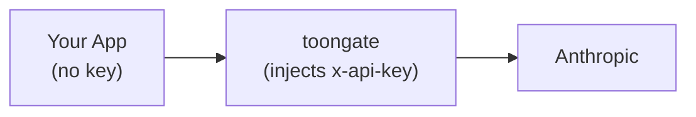

## Setup

```bash
UPSTREAM_URL=https://api.anthropic.com
ANTHROPIC_API_KEY=sk-ant-...
```

```typescript
import Anthropic from "@anthropic-ai/sdk";

const client = new Anthropic({
  baseURL: "https://toongate.workers.dev/v1",
  apiKey: process.env.ANTHROPIC_API_KEY,
});

const message = await client.messages.create({
  model: "claude-opus-4-5",
  max_tokens: 1024,
  messages: [
    {
      role: "user",
      content: [
        { type: "text", text: "Summarize these records:" },
        { type: "text", text: JSON.stringify(myDataArray) },
      ],
    },
  ],
});
```

toongate compresses the request payload, forwards it to `https://api.anthropic.com/v1/messages`, and returns the response unchanged.

---

## Supported route

| Method | Path | Description |
|---|---|---|
| `POST` | `/v1/messages` | Proxies to Anthropic Messages API |

---

## How the API key is injected

toongate injects `ANTHROPIC_API_KEY` as the `x-api-key` header on every request to `/v1/messages`. You do not need to set it in your SDK client — toongate adds it automatically.



---

## Streaming

Anthropic streaming (`stream: true`) is fully supported. toongate compresses the request payload, then passes SSE chunks back to your client as they arrive without buffering:

```typescript
const stream = await client.messages.stream({
  model: "claude-opus-4-5",
  max_tokens: 1024,
  messages: [{ role: "user", content: "..." }],
});

for await (const chunk of stream) {
  process.stdout.write(chunk.delta?.text ?? "");
}
```

Token savings are calculated from the compressed request body and written to D1 after the stream ends.

---

## Per-route threshold

To tune the eligibility threshold specifically for Anthropic messages:

```bash
TOON_THRESHOLD_MESSAGES=0.5
```

This overrides `TOON_THRESHOLD` for the `/v1/messages` route only.
