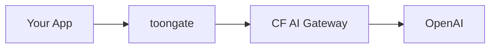

## Setup

Set `UPSTREAM_URL` to your Cloudflare AI Gateway base URL:

```bash
UPSTREAM_URL=https://gateway.ai.cloudflare.com/v1/{account_id}/{gateway_id}/openai
OPENAI_API_KEY=sk-proj-...
CF_AIG_TOKEN=vck_...   # optional — only if gateway auth is enabled
```

```typescript
const openai = new OpenAI({
  baseURL: "https://toongate.workers.dev/v1",
  // No changes to headers or other config
});
```

toongate sits in front of Cloudflare AI Gateway — it compresses the payload, then forwards to the gateway (which handles caching, logging, fallbacks) as normal.



---

## Gateway headers

All Cloudflare AI Gateway headers pass through untouched:

```typescript
const openai = new OpenAI({
  baseURL: "https://toongate.workers.dev/v1",
  defaultHeaders: {
    "cf-aig-authorization": `Bearer ${CF_AIG_TOKEN}`,
    "cf-aig-cache-ttl": "3600",
    "cf-aig-skip-cache": "false",
  },
});
```

toongate never reads or modifies headers it doesn't own. Every header your app sends arrives at the gateway unchanged.

---

## CF_AIG_TOKEN format

toongate normalizes the token automatically — pass it as a bare token or with the `Bearer` prefix:

```bash
CF_AIG_TOKEN=vck_abc123          # ✅ normalized to "Bearer vck_abc123"
CF_AIG_TOKEN=Bearer vck_abc123   # ✅ used as-is
```
