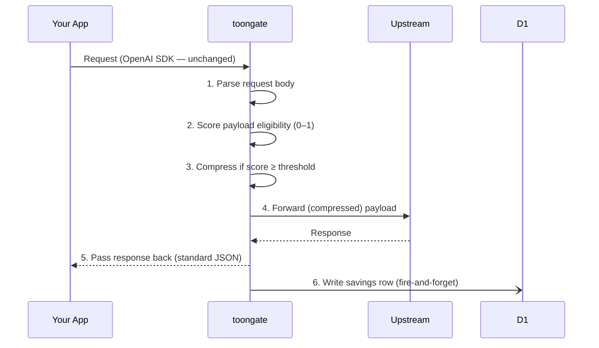
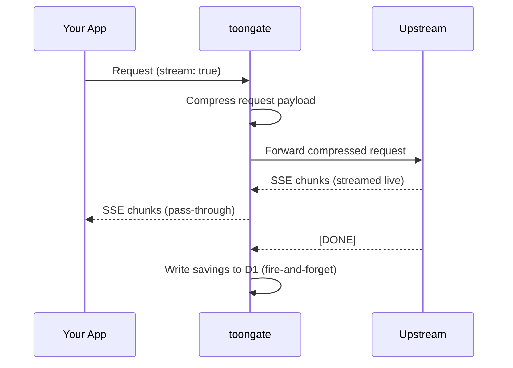

## The request lifecycle

Every request through toongate follows this path:



Your app never sees TOON. The response from toongate is always standard JSON — identical to what you'd get from OpenAI or Anthropic directly.

---

## Eligibility scoring

Before compressing, toongate scores the payload on a 0–1 scale to decide whether TOON encoding will actually help.

The scorer looks for:

- **Uniformity** — do all objects share the same keys?
- **Array length** — is there more than one element? (Single objects don't benefit)
- **Value types** — are values scalar (strings, numbers, booleans)? Nested objects don't compress well.

```
Score 0.0 – 0.4  →  pass-through (not worth encoding)
Score 0.4 – 0.6  →  borderline (depends on TOON_THRESHOLD)
Score 0.6 – 1.0  →  compress
```

Default `TOON_THRESHOLD` is `0.6`. Lower = more aggressive compression. Raise it if you want to only compress high-confidence payloads.

<Tip>
  Use **dry-run mode** to see what the scorer would do without actually compressing. Set `TOON_DRY_RUN=true` and check `X-Toongate-Eligibility-Score` headers on your real traffic before tuning the threshold.
</Tip>

---

## What TOON looks like

TOON strips repeated field names and encodes rows as pipe-delimited values:

<CodeGroup>
```json Before (JSON)
[
  {"id": 1, "title": "Getting started", "score": 0.91, "url": "https://docs.example.com/start"},
  {"id": 2, "title": "Configuration",   "score": 0.87, "url": "https://docs.example.com/config"},
  {"id": 3, "title": "API reference",   "score": 0.79, "url": "https://docs.example.com/api"}
]
```

```text After (TOON)
{id,title,score,url}[3]
1|Getting started|0.91|https://docs.example.com/start
2|Configuration|0.87|https://docs.example.com/config
3|API reference|0.79|https://docs.example.com/api
```
</CodeGroup>

The model understands TOON natively — explicit `[N]` length markers and `{fields}` headers give it a clearer schema than raw JSON. [Benchmarks show](https://toonformat.dev/guide/benchmarks.html) slightly higher accuracy (76.4% vs 75.0%) on structured tasks.

---

## Streaming

When `stream: true` is set, toongate still compresses the request payload before forwarding — but passes SSE chunks back to your app without buffering:



Token savings are calculated from accumulated chunk metadata after the stream ends, then written to D1 fire-and-forget. Your streaming experience is unaffected.

---

## Fallback behavior

toongate is designed to never break your pipeline:

| Situation | Behavior |
|---|---|
| Eligibility score below threshold | Pass original payload through unchanged |
| TOON encode error | Pass original payload through, log error |
| TOON decode error in response | Pass response through unchanged |
| Upstream timeout (`UPSTREAM_TIMEOUT_MS`) | Return `504` to client |
| D1 write fails | Swallowed silently — never blocks response |
| `TOON_DRY_RUN=true` | Compute savings estimate, send original payload |

The only thing that can fail is the upstream itself. toongate adds no new failure modes.

---

## Overhead

| Operation | Typical latency |
|---|---|
| Eligibility scoring | ~0.1ms |
| TOON encoding (1KB payload) | ~0.2ms |
| D1 savings write (fire-and-forget) | ~2ms (doesn't block) |
| **Total added to your request** | **~0.3–0.5ms** |

Cloudflare Workers run at the edge closest to your users — in most cases toongate actually *reduces* total latency compared to routing through a distant gateway.
